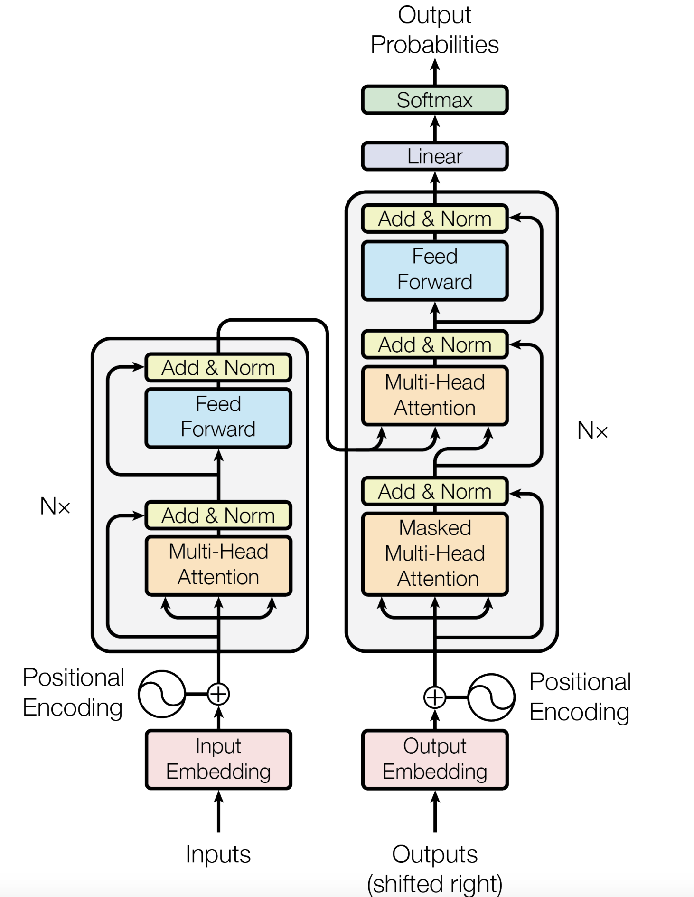

# 变形金刚的心得

- Layernorm 和Batch norm的区别  
layernorm 更针对样本来计算,计算时是以个体为中心来计算. 而batchnorm则是针对某一特征,计算整个batch的内容, 计算的结果在面临抖动时会引入不必要的误差.

- mask multi-head attention    
Attention是可以看到所有输入的一个东西,但是在实际场景中,decoder不应该看到未来的东西, 所以decoder要通过一个mask机制来对未来的东西做修正
## Transformer mechanism

## Transformer API
```python
class transformer():
    def __init__(self,
                d_model, # 特征的维度
                nhead,   # Multi-head 中头的数目
                num_encoder_layers, 
                num_decoder_layers,
                dim_feedforward, # feedforward 中间层的维度, 将multi-head的结果往高维投影
                ):
```
## Some details
### Decoder
decoder和encoder不同, decoder 有两个注意力机制, 分别是自身对于输入的self-attention以及对于endcoder和上一个注意力输出的交叉注意力层
### Position encoding
$$
PE(pos,2i)=sin(pos/10000^{2i/d_{\mathrm{model}}}) \\
PE(pos,2i+1)=cos(pos/10000^{2i/d_{\mathrm{model}}})
$$
