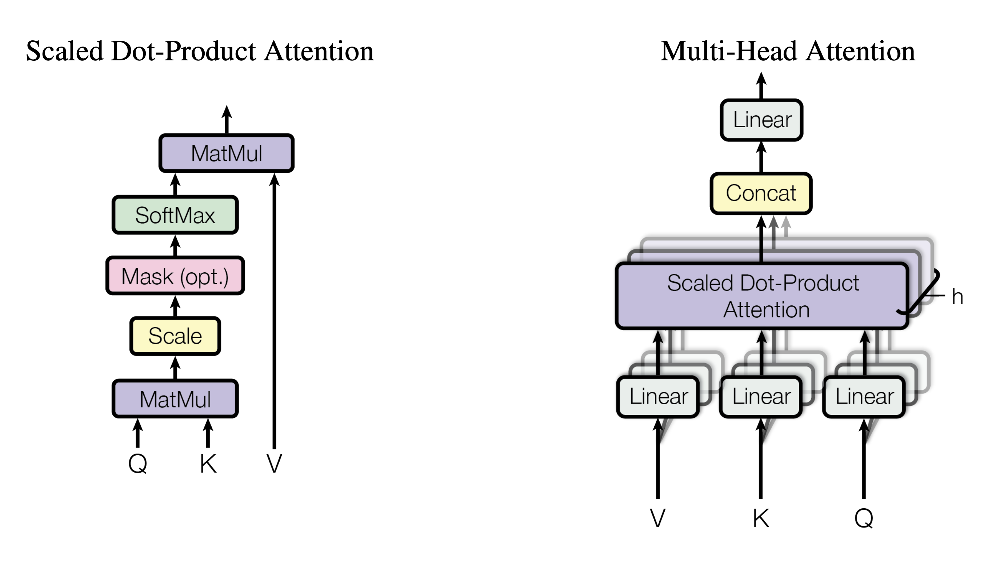

# 变形金刚的心得

- Layernorm 和Batch norm的区别  
layernorm 更针对样本来计算,计算时是以个体为中心来计算. 而batchnorm则是针对某一特征,计算整个batch的内容, 计算的结果在面临抖动时会引入不必要的误差.

- mask multi-head attention    
Attention是可以看到所有输入的一个东西,但是在实际场景中,decoder不应该看到未来的东西, 所以decoder要通过一个mask机制来对未来的东西做修正
## Transformer mechanism

## Transformer API
```python
class transformer():
    def __init__(self,
                d_model, # 特征的维度
                nhead,   # Multi-head 中头的数目
                num_encoder_layers, 
                num_decoder_layers,
                dim_feedforward, # feedforward 中间层的维度, 将multi-head的结果往高维投影
                ):
```
## Some details
采用一个例子, 先进行简单初始化
### Initialization
```python
import torch
import numpy as np
import torch.nn as nn
import torch.nn.functional as F

# example parameter
batch_size=2    # 批大小  两个样本
max_num_src_words=8  # 最大输入词表大小
max_num_tgt_words=8  # 最大输出词表大小
max_src_len=5      # 最大句子长度
max_tgt_len=5      # 最小输出句子长度
model_dim=8        # model 特征维数
# 生成测试样例
src_len=torch.tensor([2,4]).to(torch.int32)
tgt_len=torch.tensor([4,3]).to(torch.int32)
src_seq=[F.pad(torch.randint(1,8,(L,)), (0,max_src_len-L) ) for L in src_len]
tgt_seq=[F.pad(torch.randint(1,8,(L,)), (0,max_tgt_len-L) ) for L in tgt_len]
src_seq=torch.cat([torch.unsqueeze(m , 0) for m in src_seq])
tgt_seq=torch.cat([torch.unsqueeze(m , 0) for m in tgt_seq])
print(src_seq, tgt_seq)
```
### word embedding
生成一张embedding表, 取seq中的数值作为索引取得向量
```python
src_embedding_table=nn.Embedding(max_num_src_words+1,model_dim)
tgt_embedding_table=nn.Embedding(max_num_tgt_words+1,model_dim)
src_embedding=src_embedding_table(src_seq)
tgt_embedding=tgt_embedding_table(src_seq)
```
### Position encoding
这个可以增强模型的泛化能力, 使得在推理时遇到比训练时更长的句子时可以通过线性变换的到超出训练时长度的结果

\begin{gather*}
    PE(pos,2i)=sin(pos/10000^{2i/d_{\mathrm{model}}})\\
    PE(pos,2i+1)=cos(pos/10000^{2i/d_{\mathrm{model}}})\\
    PE(k,2i)=sin(k/10000^{2i/d_{\mathrm{model}}})\\
    PE(k,2i+1)=cos(k/10000^{2i/d_{\mathrm{model}}})\\
    PE(pos+k,2i)=PE(pos,2i)\cdot PE(k,2i+1)+ PE(pos,2i+1)\cdot PE(k,2i)\\
    PE(pos+k,2i+1)=PE(pos,2i+1)\cdot PE(k,2i+1) - PE(pos,2i)\cdot PE(k,2i)\\
\end{gather*}

下面是实现的代码
```python
# position encoding
max_pos_len=5
pos_mat=torch.arange(max_pos_len).reshape((-1,1))
i_mat=torch.pow(10000,torch.arange(0,8,2).reshape(1,-1)/model_dim)
pe_embedding_table = torch.zeros(max_pos_len,model_dim)
pe_embedding_table[:,0::2]=torch.sin(pos_mat/i_mat)
pe_embedding_table[:,1::2]=torch.cos(pos_mat/i_mat)
pe_embedding= nn.Embedding(max_pos_len,model_dim)
pe_embedding.weight=nn.Parameter(pe_embedding_table,requires_grad=False)
# 注意要取最大的长度, 否则无法进行矩阵拼接
src_pos= torch.cat([torch.unsqueeze(torch.arange(max(src_len)) ,0) for _ in src_len]).to(torch.int32)
tgt_pos= torch.cat([torch.unsqueeze(torch.arange(max(tgt_len)) ,0) for _ in tgt_len]).to(torch.int32)

src_pe_embedding=pe_embedding(src_pos)
tgt_pe_embedding=pe_embedding(tgt_pos)
print(src_pe_embedding)
print(tgt_pe_embedding)
```
### encoder self attention mask

!!! note "Scaled Dot-Product Attention"
    $$
    \operatorname{Attention} ( Q ,K , V ) = \operatorname {softmax}(\frac{QK^T}{\sqrt{d_k}})V
    $$
    $\sqrt{d_k}$ 是为了保持*softmax*中的数值不要太大,不然会出现概率大的非常大,小的非常小,这样一来导致函数的梯度会出现一些接近零的数,导致梯度下降没有效果.

    <center>mask‘s size = [batc_size,max_src_len,max_src_len]</center>
#### scaled dot-product attention
```python
def scaled_dot_product_attention(Q,K,V,mask,d_k):
    # shape of Q,K,V : ( batch_size * num_head , seq_len , model_dim/num_head)
    score=torch.bmm(Q,K.transpose(-2,-1)/torch.sqrt(d_k))
    mask_score=score.masked_fill(mask,-1e9)
    prob=F.softmax(mask_score,-1)
    context=torch.bmm(prob,V)
    return context
```
#### mask
```python
valid_encoder_pos= torch.unsqueeze(torch.cat([ torch.unsqueeze(F.pad(torch.ones(L),(0,max(src_len)-L)),0) for L in src_len]),2)
valid_encoder_pos_mat=torch.bmm(valid_encoder_pos,valid_encoder_pos.transpose(1,2))
invalid_encoder_pos_mat=1-valid_encoder_pos_mat
mask_encoder_matrix=invalid_encoder_pos_mat.to(torch.bool)
print(mask_encoder_matrix)
```
### intra-attention mask
!!! note "mask层形状"
    mask.shape = [ batch.size , decoder_seq_len, encoder_seq_len]
```python
# intra-attention mask
valid_encoder_pos=valid_encoder_pos
valid_decoder_pos=torch.unsqueeze(torch.cat([ torch.unsqueeze( F.pad(torch.ones(L),(0,max(tgt_len)-L)),0) for L in tgt_len]),2)
valid_cross_pos=torch.bmm(valid_decoder_pos,valid_encoder_pos.transpose(1,2))
invalid_cross_pos_mat=1- valid_cross_pos
mask_cross_attention=invalid_cross_pos_mat.to(torch.bool)
```
### decoder self attention mask(因果mask)
decoder和encoder不同, decoder 有两个注意力机制, 分别是自身对于输入的self-attention以及对于endcoder和上一个注意力输出的交叉注意力层
```python
# self attention mask in decoder
valid_decoder_tri_matrix=[torch.unsqueeze(F.pad(torch.tril(torch.ones(L,L)),(0,max(tgt_len)-L,0,max(tgt_len)-L)),0) for L in tgt_len] 
valid_decoder_tri_matrix=torch.cat(valid_decoder_tri_matrix)
invalid_decoder_tri_mat=(1-valid_decoder_tri_matrix).to(torch.bool)
```

question
- 如何根据一个word embedding 得到 三个序列 query key value呢
- 根据初始的embedding得到的QKV的linear 有没有 bias


